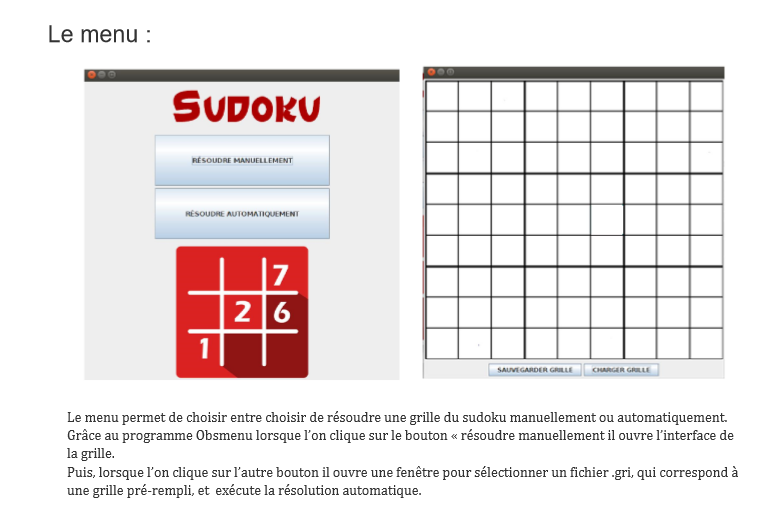
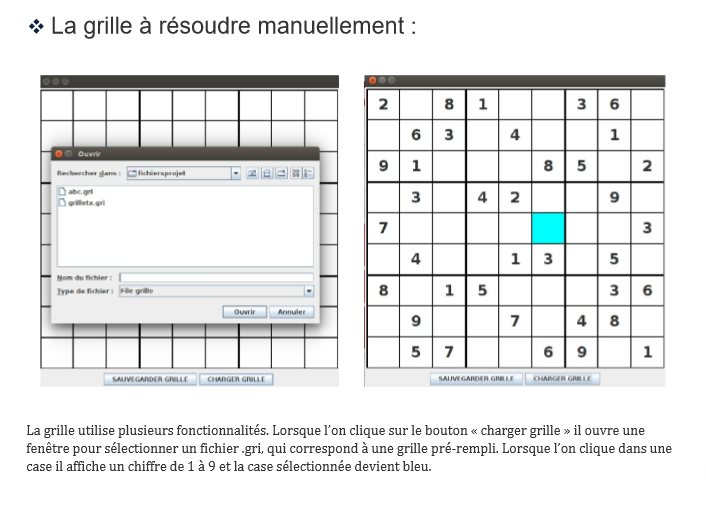
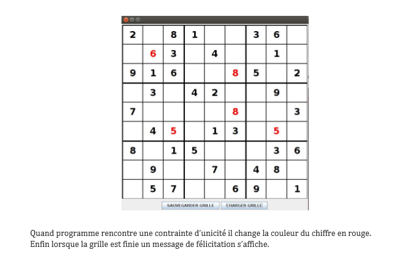

> Projet en Java - DUT Informatique 2016

### Commande pour lancer l'application :

```
 java sudoku
 ```

## Sudoku
```
 Une grille de Sudoku est composée de neuf lignes et neufs colonnes. Elle est également divisée en neuf régions couvrant chacune trois lignes et trois colonnes.
 Chaque case peut accueillir un chiffre compris entre 1 et 9, mais le même chiffre ne peut pas apparaître plusieurs fois sur une même ligne, une même colonne, ou une même région.
 On fournit au joueur une grille où seulement quelques cases sont initialement remplies. Sa tâche consiste à remplir entièrement la grille en respectant les contraintes d'unicité.

 Le projet consiste à élaborer deux programmes.  
  - Le premier programme servira à l'élaboration des grilles de départ.
    On construire une grille vide où on charge une grille existante où seulement quelques cases sont remplie depuis un autre fichier.
    Il devient alors possible d'ajouter ou d'enlever des numéros dans la grille. Une fois la grille achevée, elle sera sauvegardée dans un nouveau ou un ancien fichier.

  - Le second programme servira à résoudre une grille.
    On commencera par charger une grille depuis un fichier. Puis on choisira si on souhaite résoudre la grille manuellement ou automatiquement.
    En mode automatique, le programme affichera la grille résolue et le temps nécessaire à la résolution. En mode manuel, le joueur pourra ajouter des et enlever des chiffres.  
    En cas de doute, il pourra aussi faire temporairement cohabiter jusqu'à quatre chiffres dans une cellule.
```






